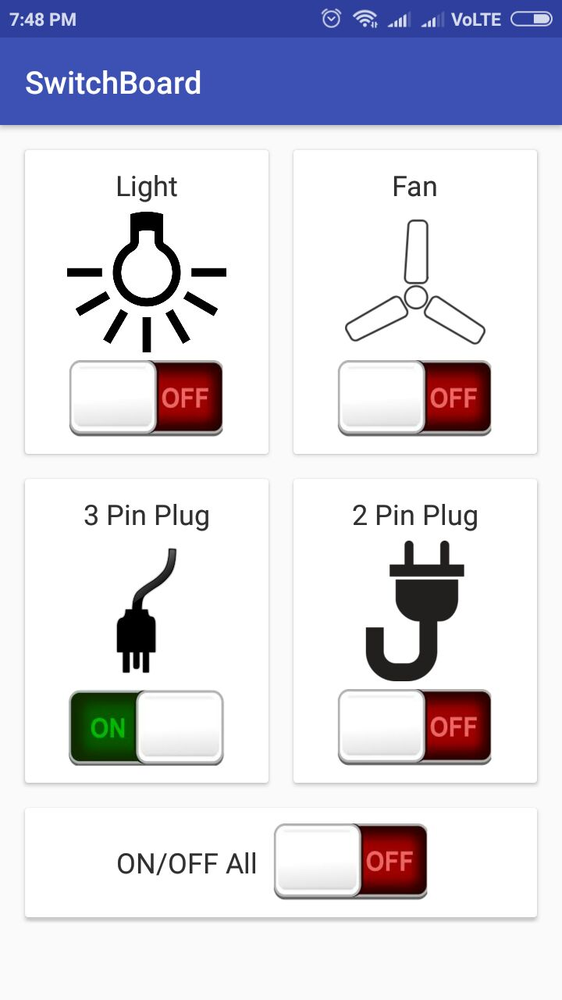

# Home Automation Android

This is an Android App for controlling home applicances over the internet using MQTT Protocol.

## Usage
Clone this repo and and put your MQTT details in AppConig.java

```java
package com.bhanu.homeautomation;

public class AppConfig {
    // your MQTT borker name here, example: tcp://183.87.92.160:1883
    public static final String MQTT_BROKER_URI = "";

    // MQTT topic subscribed by the switch board, this app publishes the messages to this topic
    public static final String SWITCH_BOARD_TOPIC = "";

    // MQTT topic to which this app subscribes
    public static final String SELF_TOPIC  = "";
}
```

## Screenshot
